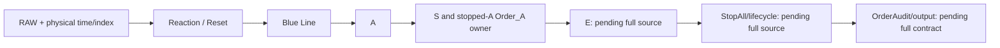

# TradingBot Intelligence Plugin and Knowledge Vault — Technical Architecture

**Snapshot date:** 2026-09-25  
**Audience:** engineers and AI agents implementing, reviewing, deploying, or extending the knowledge system  
**Scope:** the independent `TradingBot-Knowledge` Vault and `tradingbot-intelligence` reader/maintainer plugin  
**Evidence convention:** “implemented” means observed in retained or plugin code; “documented” means asserted by a Vault note; “pending” means the Vault cannot currently establish a complete rule or runtime result.

## 1. Purpose and architecture at a glance

The system packages TradingBot knowledge as a portable, inspectable Vault and provides a separate plugin that reads it. A consumer needs a Vault clone, this plugin, and a suitable Python runtime. The original TradingBot application checkout is **not** a runtime dependency for search, evidence retrieval, dataset inspection, or integrity verification. A maintainer who wants automatic source synchronization does need the original checkout. Neither the plugin nor the Vault is the live trading calculation engine: the retained engine files are evidence snapshots, and the plugin does not run them or emit trade signals.

There are three independent filesystem roots:

| Placeholder | Current local example | Role |
| --- | --- | --- |
| `<PROJECT_ROOT>` | `X:\TradingBot` | The original, changing application and Python calculation source. Needed for maintenance synchronization and source comparison. |
| `<VAULT_ROOT>` | `X:\TradingBot-Knowledge` | Git-publishable knowledge package, indexed notes, pinned code evidence, fixture evidence, and RAW input data. Operational references inside the Vault are Vault-relative. |
| `<PLUGIN_ROOT>` | `X:\TradingBot-Intelligence-Plugin` | Codex package, MCP server, dependency-free CLI reader, verification implementation, and optional maintainer scripts. |


The source of a trading rule is the original Python implementation plus a reviewed algorithm reference. The Vault records a bounded snapshot of that source and the state of review. A generated graph, test fixture, RAW hash, or current calculation output cannot silently become an accepted rule. The Vault currently lacks the comprehensive directional references and several mixed-route engine modules, so its rule layer is deliberately marked pending in many places.

## 2. Boundaries, trust, and terminology

The **project plane** contains the live chart, bridge, and full Python pipeline. The **knowledge plane** is the Vault: Markdown entities, relational indexes, byte-pinned source excerpts, fixtures, and RAW data. The **access plane** is the plugin: it locates one Vault, validates paths and evidence, and exposes read-only functions. The **maintenance plane** is in the plugin directory but runs only for a maintainer with the original project. Its post-commit hook writes into the Vault; consumers do not need it.

`Order_A` is the only retained physical order creation route. `Order_B` and `Order_C` source and algorithm material were intentionally removed pending a clean rewrite in the original project. This scope does **not** remove Reaction Mode A or Mode B, nor S Blue Type-1 through Type-4: those labels refer to different concepts. A fixture mentioning a later Mode-B reaction/order context must not be interpreted as reintroducing the excluded `Order_B` route. Some higher-stage notes mention E, StopAll, or OrderAudit as vocabulary and dependencies, but their complete implementation contract is not available in this Vault.

Use these meanings consistently:

| Term | Meaning |
| --- | --- |
| `entity` | Stable `kind.name` ID for one Markdown knowledge note. A path locates it but is not its identity. |
| `source snapshot` | Byte-exact retained file under `06_SOURCE/Code`, pinned by SHA-256 and size. This proves identity, not correctness. |
| `reference` | Reviewed, comprehensive algorithm explanation. The current manifest has zero `algorithm_references`. |
| `dataset` | One registered physical RAW JSON byte stream, identified by full SHA-256. |
| `window` | An inclusive epoch range within a retained parent RAW that reproduces a former smaller RAW byte for byte after defined serialization. |
| `fixture` | A bounded historical or current scenario assertion; not a full approved output baseline. |
| `authority` | The allowed evidentiary role of a note, separate from its lifecycle `status`. |
| `verified_pins_ok` | Registered notes, code evidence, datasets and windows satisfy the plugin verifier. |
| `inventory_complete` | No unregistered physical RAW files or sidecars remain under `08_DATA/Raw`. |

## 3. Vault layout and ownership

The Vault root is a self-contained package. Its notes and data use normalized paths relative to that root. The plugin itself is never copied into the Vault. The observed top-level layout is:

```text
<VAULT_ROOT>/
  README.md
  00_SYSTEM/          authority, retrieval, governance, and system models
  01_CORE/            common identities, chronology, provenance, definitions
  02_MARKET_MODEL/    candles, legs, ranges, resets, and directional concepts
  03_BEHAVIORS/       A, S, E, StopAll and related behavior contracts
  04_ALGORITHMS/      Reaction, Blue, A, S, E, StopAll, Order_A, RAW, audit
  05_MIRROR/          Bullish/Bearish relationships and open asymmetries
  06_SOURCE/
    Code/             pinned, byte-exact Python/JavaScript snapshots
    Modules/          source-module knowledge notes
    Pending/          unresolved or excluded source-module placeholders
  07_VALIDATION/
    Fixtures/         case notes, registry, curated source, fixture model
    Invariants/       identity, chronology, numeric and lifecycle checks
    Mirror/           directional validation contracts
    Performance/      performance evidence and open criteria
    Regression/       baseline and regression policies
    Tests/            validation contract notes
  08_DATA/
    Datasets/         dataset and exact-window notes
    Hashes/           hash conventions and registry
    Manifests/        dataset manifest
    Raw/              physical RAW JSON and optional .meta.json sidecars
  09_CASES/           reserved; no current independent authority
  10_DECISIONS/       reserved; no current independent authority
  11_VERSIONS/        reserved; no current independent authority
  12_WORKFLOWS/       reserved; no current independent authority
  _SCHEMA/            JSON schemas and deterministic index builder
  _INDEX/             generated navigation indexes and pinned manifests
  _GENERATED/         derived content, not normative source
  .obsidian/          local Obsidian configuration
  .git/              Vault Git repository metadata
```

The folder number is navigation order, not execution order. Behavior notes classify externally meaningful A/S/E/StopAll states; Reaction, Reset, Blue Line, physical Order identity, and OrderAudit are represented in algorithms/evidence instead of being mislabeled Behaviors. Empty placeholders have no evidentiary status.

At this snapshot, `_INDEX/entities.json` contains **167** entities: 20 algorithm, 15 behavior, 22 case, 10 core, 27 data, 11 market, 10 mirror, 13 source, 8 system, and 31 test. There are **1,091** generated relations. The current status distribution is 28 active, 3 archived, 15 canonical, 15 draft, 105 pending, and 1 pending-fix. Authority distribution is 21 empirical, 6 executable, 3 historical, 121 non-canonical, and 16 normative. These counts describe what the Vault claims and indexes; they are not 167 accepted trading rules. Appendix A lists every entity and its file.

## 4. Entity format, schema, and generated indexes

Each populated knowledge note is Markdown with a `---` frontmatter block. Every frontmatter value is JSON syntax following `key: `; arrays and strings are literal JSON, not generic YAML shorthand. The shared minimum fields are `id`, `type`, `status`, `authority`, `title`, `related_entities`, and `source_reference`. A typical shape is:

```text
---
id: "algorithm.order.a"
type: "algorithm"
status: "pending"
authority: "non-canonical"
title: "Order_A ..."
related_entities: ["source.s_zone_detector", "behavior.a"]
source_reference: ["06_SOURCE/Code/engine/pipeline/s_zone_detector.py#L277"]
---
```

This is a structural illustration, not a verbatim note or complete trading rule. `source_reference` uses one-based line anchors into Vault-local `06_SOURCE/Code`; `source_refs` can also describe supporting chart source. Schemas reject extra fields and enforce type-specific fields. A dataset note adds `data_kind: "dataset"`, `raw_path`, `raw_sha256`, `raw_bytes`, `row_count`, first and last epochs, provider/symbol/timeframe metadata, and relationships. A window note has `data_kind: "window"`, parent dataset, inclusive epoch bounds, original window digest and row count. A case note records fixture kind/status/authority, direction/timeframe, input digest and optional window, timestamp, behavior and algorithm targets, retained source owner, physical indices if known, bounded expected assertion, validation rule, and pinned fixture-source location. The literal string `unknown` is used when evidence is absent; readers must not transform it into a negative finding.

The schema family is `_SCHEMA/note.schema.json` plus `algorithm.schema.json`, `behavior.schema.json`, `case.schema.json`, `data.schema.json`, `source.schema.json`, and `test.schema.json`. `_SCHEMA/build_indexes.py` checks every populated note against these schemas and writes derived indexes. Generated files are:

| File | Role |
| --- | --- |
| `_INDEX/entities.json` | ID → path/type/status/authority/title lookup. |
| `_INDEX/relations.json` | Typed directed edges between entity IDs. |
| `_INDEX/knowledge-graph.json` | Node and edge representation for navigation. |
| `_INDEX/files.json` | Indexed file inventory. |
| `_INDEX/source-map.json` | Source-to-note navigation, including pending source placeholders; it is not proof of an implementation. |
| `_INDEX/source-hashes.json` | Pinned source/reference/supporting evidence and sizes; curated manifest, not generated rule authority. |
| `_INDEX/sync-status.json` | Last maintainer synchronization identity and review state. |

The index builder checks unique IDs, schema-required fields, source anchors and referenced symbols, source size/hash identity, unpinned code files, dataset bytes, exact windows, fixture-source hashes/line references, StopAll gate mappings, relation endpoints/types, and deterministic index output. `--check` recomputes and compares without changing the Vault. The plugin verifier performs a complementary runtime integrity check; the two validators are not equivalent. Do not manually edit derived indexes to alter a rule.

Relations are typed `calculated_by`, `implemented_by`, `depends_on`, `produces`, `implements`, `affects`, `parent_of`, `child_of`, `relates_to`, `supports`, and `orchestrates`. `related_entities` yields `relates_to` edges. The builder validates IDs and reciprocal `implemented_by`/`implements` and `calculated_by`/`produces` contracts; it also prevents an authoritative dependency from resolving through a non-canonical claim. An edge tells a reader where to inspect next. It does not prove the target algorithm currently works.

## 5. Authority and answer construction

Authority values are `normative` (accepted contract), `executable` (retained current source behavior), `empirical` (RAW, bounded fixture, or observation), `historical` (prior state), and `non-canonical` (unresolved/incomplete). The schema also allows `canonical` authority for mirror notes, but none is present in this snapshot. Status values include `canonical`, `active`, `draft`, `pending`, `proposed`, `pending-fix`, `deprecated`, `superseded`, and `archived`. Status and authority are separate: an active dataset can be empirical; an active case can be a bounded assertion; a canonical test note can state how to validate without proving a test was run.

A robust answer follows **Behavior → Algorithm → Source → Validation → Data** as needed. Start with an entity search, read the note and its status/authority, traverse direct relations, inspect pinned line evidence for a specific claim, then inspect fixtures/RAW identity if discussing observed behavior. If the relevant source or a comprehensive reference is absent, report the precise missing dependency and keep the claim pending. No source snapshot or generated index should be treated as a normative rule automatically. A complete normative trading rule requires retained, reviewed source and an algorithm reference over its dependency chain; this Vault currently has zero comprehensive algorithm references. For conflicts, record both sides with version, path, anchor and hash, then seek a domain decision. A newer timestamp, fixture outcome, or current executable output cannot silently resolve that conflict.

The six current `active/empirical` cases carry `fixture_authority: Canonical` for their **specific bounded assertions**. Thirteen cases are pending and three are historical. No approved, full serialized-output regression baseline is in the Vault. Thus “fixture exists” and “algorithm end-to-end result is verified” are different statements.

## 6. Retained calculation and application evidence

The original application architecture, as observed from project source and retained chart evidence, is browser chart → local Vite HTTP API/SSE → Python bridge → directional calculation pipeline → serialized JSON → API cache/rendering. The browser handles visual state and input selection; Python is the numerical calculation authority. Full-chart requests can pass the original RAW path to the bridge. A selected chart range can be filtered to inclusive chart-candle buckets in Node memory and streamed as JSON over a Windows named pipe. The bridge receives only that selected input, so state before the range does not exist for that run; this is a meaningful input/chronology boundary, not merely a display filter. The bridge itself is **absent** from the Vault, so its full orchestration and serialization cannot be independently reconstructed from this package alone.

The retained Python snapshot set consists of nine manifest-listed files:

| Vault-local source | Bytes | SHA-256 | Evidentiary role |
| --- | ---: | --- | --- |
| `06_SOURCE/Code/engine/pipeline/__init__.py` | 348 | `ca549e4cf5d9a070227498d0d210279e0f7edae66d62dadab7981cddaa1db5c3` | package boundary |
| `06_SOURCE/Code/engine/pipeline/reaction_engine.py` | 103,120 | `bea0d5a5e95ee15ad54d024f6c01b8c777ba2abcc3c8e671118f1ae2df28f2a6` | Candle/Candidate, chronology, Bullish and reflected Bearish Reaction/Reset |
| `06_SOURCE/Code/engine/pipeline/direction_policy.py` | 2,282 | `a27ac63c2f066311c9381e2ead6fb44f0789f423a37b465da65c80e6329397ea` | strict directional extrema and crossing rules |
| `06_SOURCE/Code/engine/pipeline/core_utils.py` | 885 | `3dae390ae77b72965f5799f7c132c4eba203775d5e72761fd7dd60c90f8578de` | Decimal conversion and physical Order identity |
| `06_SOURCE/Code/engine/pipeline/blue_line_detector.py` | 15,802 | `6fa01d94bc98060b62bc7e68db0ec24a0b0159727d44043affee7130a9c11448` | Blue Line Fibonacci 0.618 and strike logic |
| `06_SOURCE/Code/engine/pipeline/a_zone_detector.py` | 31,007 | `d7c33dd619ad7e4590027667a2c4e984c83be7b82fbfafeb5d7f944ddd521097` | A formation from Blue context |
| `06_SOURCE/Code/engine/pipeline/s_zone_detector.py` | 65,869 | `7714025b3f43087b09844df6feeef4eef0ec72eeb841115293df4c126fd202ee` | S candidates and stopped-A first `Order_A` owner |
| `06_SOURCE/Code/engine/__init__.py` | 45 | `b8cf63f6eb68b0cdb2b05f1173d4e0d03ab01b68c54f7a26b29fb3180377de8c` | package boundary |
| `06_SOURCE/Code/engine/bridge/__init__.py` | 64 | `2bc59770b9d4313c0e6306287d074487b9e1672dbaf3ada9a8be381e7123f0b8` | package boundary only, not the bridge |

Three chart JavaScript files are supporting, also byte pinned: `apps/chart/server/indicator-range-input.js` (`bf9b2c5eac9457435f9aaed9615ca062dfabcb7541ca70fbf114c9dd2f1a419f`, 4,248 bytes), `apps/chart/server/raw-resource-store.js` (`4b34716fc1537f6983d9b2d8200561fa65819180f1033d71dad978c8328c3baa`, 17,253 bytes), and `apps/chart/vite.config.js` (`9baf5c9745a96058e27b485b885dfc5a868e4256016d9ec38e14a442f7a5f58c`, 36,108 bytes). The manifest additionally pins one curated fixture-source Markdown file and five RAW sidecars. These twelve code files were byte-compared with the observed original project checkout at this snapshot; future project commits may change that relationship.

Conceptual retained stage graph:



The graph communicates dependency and source coverage, not a guaranteed execution trace. Exact Decimal semantics, strict inequalities, physical indices/times, source/parent identity, nulls, version fields, and order of serialized collections matter when implementing or comparing the real engine. Bullish and Bearish paths include specific asymmetries; they must be read from retained source, not generated by blind inversion. The retained source shows `Order_A` physical identity based on `(FirstIndex, BreakIndex)` and a first-owner decision for a stopped A. E, lifecycle, and the bridge are omitted because their present project files mix excluded routes; source notes in `06_SOURCE/Pending` preserve this gap without pretending to provide the code. `algorithm.orderaudit` is explicitly `pending-fix/non-canonical`. The current package cannot certify E/StopAll outcomes, the full output schema, or end-to-end numerical parity.

### 6.1 Stage semantics visible in the retained subset

The following is a **bounded orientation to retained code**, not a complete normative trading specification. All four broad algorithm notes remain `pending/non-canonical` because the comprehensive algorithm reference and later-stage dependency chain are absent. The code anchors in the notes and manifest, not this prose, are the evidence for any implementation decision.

| Stage | Observable inputs and decisions | Produced evidence and present limit |
| --- | --- | --- |
| Reaction/Reset | RAW-derived main and lower chronology, direction policy, First/context candle roles, strict box crossings, and physical First/Break identity. The retained note describes Bullish First as RED after GREEN context and Bearish First as GREEN after RED context. A Bullish confirmation requires `High > BoxTop`; Bearish requires `Low < BoxBottom`. Native Reaction Mode A handles first/Reset recovery; Mode B handles continued Normal search. | Candidate, confirmation, Reset and internal/public geometry with exact source times/indices. Same-main-candle event ordering can require lower-timeframe comparison. This is distinct from physical `Order_A`/excluded routes. |
| Blue Line | Reaction geometry and Reset events, Decimal prices, 0.618 level, strict directional extrema, Scale/Reset strikes, formation spacing, and first strict stop. | Scale or Reset Blue with source extreme, line price, validity, and stop evidence. The drawing line and semantic stop level are different fields. |
| A | Ordered calculation-valid Blue pairs, exact formation/stop chronology, validating Reaction, inherited stops and special Reset-Blue cases. | A candidate/behavior with trigger, source, stop and pair-cycle ownership. Strict temporal boundaries and the full main candle at some inherited-stop endpoints matter. |
| S and `Order_A` | An eligible A's first strict stop, opposite Reaction candidates, order-free Type-3/4 routes, Order-backed Simple/Advanced candidates, exact lower-event race and fallback. | S Red/Blue decision and provenance. The first canonical opposite Reaction after an eligible stopped A can become the immutable `Order_A` parent-stop owner, ranked by confirmation time and physical First/Break indices. This is the retained physical order route. |
| E, reconciliation, lifecycle, StopAll, serialization | Notes outline dependencies, family/owner vocabulary, candidate gate concepts and tests. Their named implementing modules and bridge serializer are missing from the Vault. | **No independently verifiable complete rule or public output contract** in this package. Treat their detailed note prose as pending context until clean source and reviewed references are republished. |

The 15 Behavior entities express A, S, E and StopAll families and variants. S Red/Blue and Blue Type-1..4 are behavior classifications tied to S decision paths; they do not designate separate physical Order routes. E Red/Blue and StopAll Type-1..3 are modeled for dependency and future validation, while their full calculation ownership remains pending. The 10 Mirror notes flag direction-specific checks; they cannot be promoted merely by algebraic inversion. The 31 Test notes define checks such as source identity, precision, lifecycle, mirror and zero-difference comparison, but do not record that every such check has been run on a complete engine.

### 6.2 Source and metadata dependency example

Consider a question about whether a later Reaction Mode-B candidate may replace the first stopped-A `Order_A` owner. The reader first resolves `algorithm.order.a` (currently `active/empirical`), follows its `implemented_by` edge to `source.s_zone_detector`, and reads the pinned `s_zone_detector.py` lines around the source anchor. It can then inspect `case.fixture_1_1` for the bounded `(FirstIndex, BreakIndex) = (689, 693)` ownership assertion, plus its dataset SHA. The answer may state the retained first-owner behavior, with those citations and the present review state. It must not infer a complete E lifecycle, an `Order_B` implementation, or a fresh full-output regression result from that case.

## 7. RAW identity, windows, and provenance

The registered RAW payload is a JSON array of OHLC candles with `time`, `open`, `high`, `low`, and `close`. Time is an epoch-second physical timestamp; the chart RAW store checks schema, OHLC bounds and strictly increasing chronology. Dataset metadata records symbol, broker label, nominal resolution, actual first/last rows, count, exact bytes, and SHA-256. Provider labels from filenames or sidecars are metadata, not proof of a market venue or upstream data provenance. A long interval between rows is a gap candidate, not automatically a missing market record. The same physical RAW can be used for either direction, but `direction_support` is not evidence that both calculations ran.

The seven registered physical datasets are:

| Dataset ID | Instrument / nominal resolution | Rows | Inclusive first..last epoch | Full RAW SHA-256 | Note status |
| --- | --- | ---: | --- | --- | --- |
| `data.dataset_062df750` | USOIL / FXCM / 5s | 57,963 | 1788839600..1789159495 | `062df750514715ecc57ff6e5c16c4c36fc4d8ed3020620654a505b3eeffc9ea6` | active |
| `data.dataset_7e12ea5f` | USOIL / FXCM / 5s | 30,935 | 1790018400..1790196980 | `7e12ea5f56754b2cc408753c34d7a7482de1e8eb0d9773bba577208d16903e17` | active |
| `data.dataset_9e2e159a` | USOIL / FXCM / 5s | 36,821 | 1789082610..1789457625 | `9e2e159ae32976db8a88a9642414bceb46b0fdba0935a32caee7969036f10c2c` | active |
| `data.dataset_b47246b4` | XAUUSD / FOREXCOM / 5s | 25,877 | 1790062200..1790195740 | `b47246b45bb66db9ddfb75b6a431e5b6a7fced5fd521e358e5d5c438f91641dc` | active |
| `data.dataset_ea82be1a` | XAUUSD / FOREXCOM / 5s | 354,698 | 1787617410..1790173875 | `ea82be1aa715f266dab711b6f65139780402afa0529d6fcedde7cc579fdad7f9` | active |
| `data.dataset_f531a06d` | XAUUSD / FOREXCOM/FARAZ / 1s | 621,326 | 1788449740..1789501784 | `f531a06d89e518964d4579f6b126ffdcd2b4f31fe2b6e4828ef71fd122809da3` | draft |
| `data.dataset_f5bc29e3` | XAUUSD / FOREXCOM / 5s | 309,906 | 1787617410..1789765170 | `f5bc29e3ccb08b1cfb322c0ad2c86c0585949c8e0918b63b2e7837b795446974` | active |

The FARAZ 1s file has an unresolved filename/end-time mismatch: its final candle epoch is `1789501784`, whereas the filename's stated end corresponds to `1789388126`; therefore its full-file note is draft. The 309,906-row XAUUSD 5s file remains independently retained even though a larger file covers its time interval: the larger file contains one extra candle in that interval, so it is not an exact replacement. Preserving physical input identity prevents silent index and algorithm drift.

Three registered windows represent exact former smaller inputs inside retained parents:

| Window ID | Parent | Rows | Inclusive epoch range | Original small-RAW SHA-256 |
| --- | --- | ---: | --- | --- |
| `data.window_0291455b` | `data.dataset_f531a06d` | 161,376 | 1788449740..1788824908 | `0291455b94b2a536b75b6129f3a90b71cd2eadb40a6a685f8a4e01dc2e744776` |
| `data.window_18632e27` | `data.dataset_ea82be1a` | 183,741 | 1788448440..1789765175 | `18632e270173105be865ea00608290bb70de2c8129e3622c6dcab1e7f1225ee0` |
| `data.window_d33c7e2c` | `data.dataset_ea82be1a` | 14,140 | 1789585500..1789659935 | `d33c7e2c46440f7a4495bac7d80b38101a635491f0f95b8ea353caa8fdb7d96d` |

Window reconstruction is deterministic: load the parent array; use `bisect_left` on candle times for `first_epoch` and `bisect_right` for `last_epoch`; select that half-open Python slice, which corresponds to inclusive timestamp bounds; serialize with `json.dumps(selected, separators=(",", ":")).encode("utf-8")`; compare count, first/last times, and SHA-256 with the window note. The resulting digest matches the former small RAW. A fixture associated with a window must calculate from the **selected slice**. Calculating from the entire parent changes the input history and physical indexes.

At this snapshot, the three former smaller RAW JSON files and their three `.meta.json` sidecars remain physically under `08_DATA/Raw` even though they are not registered as active inputs. The registered inventory is seven files; the physical directory contains ten RAW JSON files and eight sidecars (five pinned, three extra). Consequently `verified_pins_ok` can be true while `inventory_complete` and overall `ok` are false. No consumer should choose an unregistered file merely because it exists on disk. The user explicitly chose to keep non-identical overlapping RAWs, including the 309,906-row file. Deleting physical superseded files is a separate, unresolved cleanup action.

## 8. Fixture model and validation scope

The curated source `07_VALIDATION/Fixtures/Sources/TradingBot_Fixtures_Regression_Anchors.md` is pinned at SHA-256 `0f49b80a0caa687b8f5e8fc5cb7d16dc934393528db5e0a7694d6ef744f440e5`. Each fixture note points to a specific section/line and pins its RAW dataset digest. Window-backed cases also carry inclusive epoch bounds, row count and original window digest. The registry has 22 cases: 4 Confirmed, 12 Regression, 3 EdgeCase, and 3 Bug; six Active, thirteen Pending, and three Historical. Active IDs are `case.fixture_1_1`, `case.fixture_1_9`, `case.fixture_1_11`, `case.fixture_3_1`, `case.fixture_3_2`, and `case.fixture_4_1`. Historical IDs are `case.fixture_1_13`, `case.fixture_2_5`, and `case.fixture_8_1`; all others are Pending.

A fixture can state a specific expected relationship such as “the first eligible `Order_A` keeps stopped-A parent-stop ownership” and identify physical `(FirstIndex, BreakIndex)`. That is a bounded regression assertion, not a full calculation payload, accepted E/StopAll rule, or fresh execution record. The case schema separates `fixture_status`/`fixture_authority` from note `status`/`authority`: Active maps to `active/empirical` with Canonical fixture authority; Pending to `draft/non-canonical`; Historical to `archived/historical`. A future full regression baseline needs exact input/window, settings, source identity, expected serialized outputs in both directions, and a fresh comparison. Existing computed outputs are not approved baselines.

## 9. Plugin package and runtime files

The plugin is a local directory package, presently version `0.1.3`. Its files have separate responsibilities:

| Plugin path | Responsibility |
| --- | --- |
| `plugin.json` | Plugin identity `tradingbot-intelligence`, version, description, author, `com.openai` read capability and two default prompts. |
| `.agents/plugins/marketplace.json` | Local marketplace identity `tradingbot-local`, package source `./`, availability/on-use policy. |
| `mcp.json` | `tradingbot_knowledge` stdio server declaration; launches `python -B scripts/launch_mcp.py` from plugin root. |
| `skills/tradingbot-knowledge/SKILL.md` | Agent-facing retrieval procedure and authority/evidence constraints for Codex. |
| `vault_reader.py` | Vault locator, guarded file access, indexed note reader, search, relations, dataset/window metadata, pinned source excerpts, runtime verification. |
| `mcp_server.py` | Seven thin MCP tool wrappers over `vault_reader`; no trading calculations. |
| `vault_cli.py` | Standard-library JSON CLI for hosts without MCP. |
| `scripts/launch_mcp.py` | Select Python with MCP SDK and execute server over stdio. |
| `scripts/configure_vault.py` | Atomically save a per-user Vault path after minimal Vault shape checks. |
| `maintenance/sync_sources.py` | Manifest-limited post-commit source snapshot sync, review-state writing, and index rebuild/rollback. |
| `maintenance/install_hook.py` | Install a project Git `post-commit` hook if none exists; never overwrite an existing hook. |
| `maintenance/dedupe_raw.py` | One-time RAW migration/helper, not used in consumer runtime. |
| `maintenance/exclude_order_bc.py` | One-time excluded-route migration/helper, not used in consumer runtime. |
| `requirements.txt` | Runtime MCP SDK pin `mcp==2.2.0`. |
| `maintenance/requirements.txt` | Maintainer index-builder dependency (`jsonschema>=4.18,<5`). |
| `test_vault_reader.py`, `maintenance/test_*.py` | Plugin-reader and maintainer behavior tests. |
| `README.md`, `Plugin-Contract.md`, `MCP-Contract.md`, `Tool-Catalog.md`, `Version-Pinning.md`, `Context-Recipes.md` | Human-facing setup, protocol, integrity, and usage guidance. |

The plugin's per-user configuration file is outside both package roots, by default `~/.config/tradingbot-intelligence/vault.json` with `{"vault_root":"<absolute clone path>"}`. `TRADINGBOT_PLUGIN_CONFIG` selects a different config-file location. `TRADINGBOT_KNOWLEDGE_VAULT` overrides path discovery; when set, only that candidate is checked. Otherwise the reader tries the saved config and then a sibling `TradingBot-Knowledge`. A candidate must contain `_INDEX/entities.json` and `00_SYSTEM/AUTHORITY_MODEL.md`. `vault_reader.ROOT` is resolved at module import, so a running process should be restarted after changing the Vault location.

The reader rejects non-normalized relative paths, backslashes, colons, empty/dot/dot-dot segments, and symlink resolutions outside the requested Vault subtree. It validates indexed note metadata (`id`, `type`, `status`, `authority`, `title`) against the note's frontmatter before returning a result. This catches stale index labels; full deterministic index/schema validation is the builder's job. A source excerpt can only come from pinned `.py`, `.js`, or `.md` under `06_SOURCE/Code`, and its SHA-256 is checked on each read. The CLI uses Python's standard library; the MCP server additionally needs the pinned SDK. Python 3.10+ is the stated minimum. The MCP launcher checks, in order, `TRADINGBOT_PLUGIN_PYTHON`, the invoking interpreter, plugin-local Windows/Unix `.venv`, and the Codex bundled Python path; each candidate must import `MCPServer` before execution.

## 10. MCP and CLI contract

Seven read-only MCP tools are exported. Arguments and practical response shape are:

| Tool | Parameters | Returns / important behavior |
| --- | --- | --- |
| `search_knowledge` | `query: str`, `limit: int = 8` | Ranked ID/title/body matches with path, status, authority, sync review state, excerpt. Limit clamped to 1..25. |
| `get_knowledge` | `entity_id: str` | One full indexed note plus metadata and sync review state; rejects unknown/stale IDs. |
| `trace_relations` | `entity_id: str` | Incoming/outgoing `{from,type,to}` relations. |
| `get_dataset` | `entity_id: str` | Dataset note frontmatter, RAW presence and byte size; **does not hash the RAW at retrieval time**. |
| `get_raw_window` | `entity_id: str` | Window metadata, parent RAW path and inclusive range; use verifier for actual window digest. |
| `read_source_evidence` | `path: str`, `start_line: int = 1`, `line_count: int = 40` | Numbered, hash-verified excerpt of at most 120 lines. |
| `verify_vault` | none | Integrity and inventory status, counts, sync state, failures and extra RAW paths. |

The CLI has corresponding subcommands: `search QUERY [--limit N]`, `entity ID`, `relations ID`, `dataset ID`, `window ID`, `evidence PATH [--start N --count N]`, and `verify`. Each prints JSON. Errors print JSON to stderr and exit nonzero; `verify` exits 1 when `ok` is false. Neither interface returns complete large RAW arrays. `search` uses case-folded lexical word matches; it scores ID/title/body, sorts by score then ID, and has no semantic embedding layer. A low or zero search score is not proof that a rule does not exist.

Example consumer setup and query (replace placeholders with local absolute paths):

```text
python -B <PLUGIN_ROOT>/scripts/configure_vault.py <VAULT_ROOT>
python -B <PLUGIN_ROOT>/vault_cli.py verify
python -B <PLUGIN_ROOT>/vault_cli.py search Order_A
python -B <PLUGIN_ROOT>/vault_cli.py entity algorithm.order.a
python -B <PLUGIN_ROOT>/vault_cli.py relations algorithm.order.a
python -B <PLUGIN_ROOT>/vault_cli.py evidence 06_SOURCE/Code/engine/pipeline/s_zone_detector.py --start 277 --count 30
```

For Codex, install this local package as `tradingbot-intelligence@tradingbot-local`, configure the Vault clone, and start a new task so the skill and MCP declarations load. For another AI host, register `<PLUGIN_ROOT>/scripts/launch_mcp.py` as a local stdio MCP server with an interpreter that has the SDK, or give the host access to the CLI and cloned Vault. GPT, Claude, GLM, Kimi, and DeepSeek name model families, not a common plugin-installation protocol; portability depends on their host application's MCP/CLI/file capabilities. The plugin does not require the original project or a private absolute project path at consumer runtime.

## 11. Verification semantics and current observed state

`verify_vault` checks indexed note identity and coverage, relation endpoints, source manifest sizes/hashes, absence of unpinned evidence files, registered RAW bytes/hashes, and each reconstructed window. It detects unregistered RAW JSON and `.meta.json` sidecars separately. Its response contains `failures`, `verified_evidence`, `verified_datasets`, `verified_windows`, `verified_pins_ok`, `inventory_complete`, `ok`, the unregistered-path lists, and `sync_status`. `get_dataset` is intentionally cheaper and only checks presence/size; call `verify_vault` before claiming integrity. A malformed window is recorded as a failure rather than crashing the whole verifier.

The last observed verification state was **18 pinned evidence files**, **7 registered datasets**, and **3 exact windows** with `verified_pins_ok: true`, but `inventory_complete: false` and therefore `ok: false`, because three unregistered smaller RAW files and three sidecars remain physically in the Vault. The last `_INDEX/sync-status.json` records project commit `822c5ce1c1e7f464d2e08085fd6d991ee1d5d8ed`, `review_state: needs_review`, and two dirty paths: `a_zone_detector.py` and `vite.config.js` under `06_SOURCE/Code`. The Vault copies matched the observed project bytes at this review, but the dirty markers mean the capture is not simply a clean commit snapshot. A fresh reader must inspect its own status; this paragraph is a dated observation, not a permanent guarantee.

The Vault index builder's last check passed with 167 entities and 1,091 relations. The plugin reader tests (13) and maintenance tests (6) passed, the project's chart tests (156) passed, and the installed Codex cache's seven-tool MCP handshake passed in the preceding verification run. Those checks establish packaging, retrieval, data identity, and selected application tests. They do **not** establish complete E/StopAll/OrderAudit trading correctness, numerical equivalence of all stage outputs, or GitHub publication. The Vault and plugin directories have independent distribution lifecycles; an uncommitted local Vault file is not automatically present in a remote clone.

## 12. Post-commit synchronization and update procedure

`maintenance/install_hook.py --project <PROJECT_ROOT> --vault <VAULT_ROOT>` installs a Git `post-commit` hook only when the hook path does not already exist. The hook invokes `maintenance/sync_sources.py` with absolute roots. This is a **local** post-commit action; it does not stage, commit, or push the Vault. It does not discover new source files or import a full project tree. A maintainer must deliberately add new allowed files to the manifest and knowledge model.

For each manifest-listed code path, sync derives the original project path by removing `06_SOURCE/Code/`. It checks Git porcelain for dirty work; dirty paths are skipped and reported. It checks that `HEAD:path` exists, reads the clean working-tree bytes, blocks excluded `Order_B`/`Order_C` route patterns, and AST-parses Python files. When bytes differ from the pinned SHA, sync updates only that source snapshot, manifest hash/size, and linked source-note hashes. It writes sync review status, rebuilds the deterministic indexes, and rolls back touched source/index files on index-build failure or write exception. A `--check` run reports prospective status without writing. If a previous review was pending and no bytes change, the review flag is preserved; a clean technical sync is not a semantic approval.

Maintenance requires `jsonschema` for the Vault builder. Source and algorithm review still need a human/domain decision, especially if the original project source is changed or mixed modules are split after the `Order_B`/`Order_C` rewrite. A maintainer should run the index builder with `--check`, run plugin `verify`, inspect the precise source diff and authority impact, run relevant project tests, then commit and publish the Vault separately. Until missing comprehensive references and stage modules are safely scoped and retained, source sync cannot promote pending rules to normative automatically.

## 13. Reimplementation and extension invariants

An engineer rebuilding this system from this document should preserve these contracts:

1. Keep three roots independent. A Vault clone alone contains all consumer knowledge/data paths; the reader must resolve them inside the clone. The original checkout is only a maintainer input.
2. Keep stable entity IDs separate from file paths. Markdown frontmatter is canonical knowledge metadata; indexes are deterministic caches. Reject stale IDs/labels, invalid relations, escaped paths and unpinned code.
3. Keep status and authority distinct. “Pending,” “empirical,” “executable,” and “normative” must produce different answer language. No current output or RAW hash is an accepted trading rule by itself.
4. Keep `Order_A` as the only retained physical order route. Do not infer `Order_B`/`Order_C` from Reaction Mode B, S Blue type labels, or old fixtures.
5. Preserve exact source-byte and RAW-byte identities. Include SHA-256 and size in manifests; validate source excerpts before returning them; use the exact window serialization/digest and input slice for fixture calculations.
6. Preserve numerical/temporal semantics if rebuilding the original calculation engine: Decimal arithmetic, strict crossings, explicit inclusive windows, physical source index/time, parent and Order provenance, nullable fields, and direction-specific behavior. This document describes architecture, not a substitute for omitted algorithm source.
7. Separate integrity from correctness. `verify` can prove registered bytes and indexes while overall inventory remains incomplete; passing tests cannot certify omitted E/lifecycle/bridge logic or absent output baselines.
8. Keep maintenance conservative. Sync only manifest-listed clean tracked files, reject excluded routes, record review state, and publish the Vault with a separate intentional Git action.

## 14. Known gaps and decisions still open

The current Vault intentionally has **zero** comprehensive directional algorithm references; therefore most core/market/behavior/algorithm/mirror entries remain `pending/non-canonical`. The full `e_zone_detector.py`, `lifecycle_engine.py`, and `engine/bridge/trading_pipeline.py` were not retained because their current project versions mix excluded Order routes. A complete exact algorithm reference, output schema, and end-to-end parity claim cannot be recreated from this Vault alone. The project-side source and future rewrite must settle those rules, then the Vault can capture reviewed source and references.

Three superseded smaller RAWs and sidecars are still physically present, causing inventory verification to fail; their logical inputs are registered as hash-exact parent windows. The larger XAUUSD 5s file does not replace the separate 309,906-row file exactly, so both are registered. The FARAZ 1s file's filename/end-row conflict remains draft. The last sync state requires review of two dirty project paths. No approved full calculation baseline, automated GitHub publication, or universal cross-host plugin installer has been established. Each limit is explicit so a downstream AI cannot mistake a portable reader for a complete independent trading engine.

## Appendix A — Complete indexed entity catalog

The following table is generated from this snapshot's `_INDEX/entities.json`. `Path` is relative to `<VAULT_ROOT>`. Status and authority are shown for every indexed note so this report can be used without the Vault's navigation files.

| Entity ID | Title | Vault-relative path | Status | Authority |
| --- | --- | --- | --- | --- |
| `algorithm.a` | A calculation | `04_ALGORITHMS/A.md` | pending | non-canonical |
| `algorithm.blue` | Blue Line | `04_ALGORITHMS/Blue.md` | pending | non-canonical |
| `algorithm.e` | E construction and recursive chains | `04_ALGORITHMS/E.md` | pending | non-canonical |
| `algorithm.internal_reaction` | Internal Reaction | `04_ALGORITHMS/Reaction/Internal-Reaction.md` | pending | non-canonical |
| `algorithm.lifecycle` | Lifecycle eligibility and stage ownership | `04_ALGORITHMS/Lifecycle.md` | pending | non-canonical |
| `algorithm.order` | Physical Order and provenance | `04_ALGORITHMS/Order/Order.md` | pending | non-canonical |
| `algorithm.order.a` | Order_A parent-stop cause | `04_ALGORITHMS/Order/Order-A.md` | active | empirical |
| `algorithm.orderaudit` | OrderAudit (pending fix) | `04_ALGORITHMS/OrderAudit.md` | pending-fix | non-canonical |
| `algorithm.raw` | RAW normalization and candle construction | `04_ALGORITHMS/RAW.md` | pending | non-canonical |
| `algorithm.reaction` | Reaction | `04_ALGORITHMS/Reaction/Reaction.md` | pending | non-canonical |
| `algorithm.reconciliation` | E and lifecycle reconciliation | `04_ALGORITHMS/Reconciliation.md` | pending | non-canonical |
| `algorithm.reset` | Reset | `04_ALGORITHMS/Reaction/Reset.md` | pending | non-canonical |
| `algorithm.s` | S calculation and decision | `04_ALGORITHMS/S/S.md` | pending | non-canonical |
| `algorithm.s.type1` | S Type-1 Simple | `04_ALGORITHMS/S/Type-1.md` | pending | non-canonical |
| `algorithm.s.type2` | S Type-2 Advanced | `04_ALGORITHMS/S/Type-2.md` | pending | non-canonical |
| `algorithm.s.type3` | S Type-3 Reset-leg | `04_ALGORITHMS/S/Type-3.md` | pending | non-canonical |
| `algorithm.s.type4` | S Type-4 Blue-qualified aligned Reaction | `04_ALGORITHMS/S/Type-4.md` | pending | non-canonical |
| `algorithm.serialization` | Public serialization | `04_ALGORITHMS/Serialization.md` | pending | non-canonical |
| `algorithm.stopall` | StopAll gate state machine | `04_ALGORITHMS/StopAll.md` | pending | non-canonical |
| `algorithm.visibility` | Final visibility and lineage | `04_ALGORITHMS/Visibility.md` | pending | non-canonical |
| `behavior.a` | A | `03_BEHAVIORS/A.md` | pending | non-canonical |
| `behavior.e` | E | `03_BEHAVIORS/E/E.md` | pending | non-canonical |
| `behavior.e.blue` | E Blue | `03_BEHAVIORS/E/Blue.md` | pending | non-canonical |
| `behavior.e.red` | E Red | `03_BEHAVIORS/E/Red.md` | pending | non-canonical |
| `behavior.s` | S | `03_BEHAVIORS/S/S.md` | pending | non-canonical |
| `behavior.s.blue` | S Blue | `03_BEHAVIORS/S/Blue.md` | pending | non-canonical |
| `behavior.s.blue.type1` | S Blue Type-1 | `03_BEHAVIORS/S/Blue-Type-1.md` | pending | non-canonical |
| `behavior.s.blue.type2` | S Blue Type-2 | `03_BEHAVIORS/S/Blue-Type-2.md` | pending | non-canonical |
| `behavior.s.blue.type3` | S Blue Type-3 | `03_BEHAVIORS/S/Blue-Type-3.md` | pending | non-canonical |
| `behavior.s.blue.type4` | S Blue Type-4 | `03_BEHAVIORS/S/Blue-Type-4.md` | pending | non-canonical |
| `behavior.s.red` | S Red | `03_BEHAVIORS/S/Red.md` | pending | non-canonical |
| `behavior.stopall` | StopAll | `03_BEHAVIORS/StopAll/StopAll.md` | pending | non-canonical |
| `behavior.stopall.type1` | StopAll Type-1 | `03_BEHAVIORS/StopAll/Type-1.md` | pending | non-canonical |
| `behavior.stopall.type2` | StopAll Type-2 | `03_BEHAVIORS/StopAll/Type-2.md` | pending | non-canonical |
| `behavior.stopall.type3` | StopAll Type-3 | `03_BEHAVIORS/StopAll/Type-3.md` | pending | non-canonical |
| `case.fixture_1_1` | 1.1 2026-08-25 — Order_A ownership / immutable first Order | `07_VALIDATION/Fixtures/Confirmed/Fixture-1-1.md` | active | empirical |
| `case.fixture_1_10` | 1.10 2026-08-28 — exact-key StopAll | `07_VALIDATION/Fixtures/Regression/Fixture-1-10.md` | draft | non-canonical |
| `case.fixture_1_11` | 1.11 2026-08-28 — S Blue Type-4 | `07_VALIDATION/Fixtures/EdgeCases/Fixture-1-11.md` | active | empirical |
| `case.fixture_1_12` | 1.12 2026-09-04 02:36:00 — repeated-Blue reversal StopAll | `07_VALIDATION/Fixtures/Regression/Fixture-1-12.md` | draft | non-canonical |
| `case.fixture_1_13` | 1.13 2026-09-09 — historical Mode-B refresh chain | `07_VALIDATION/Fixtures/Bugs/Fixture-1-13.md` | archived | historical |
| `case.fixture_1_4` | 1.4 2026-08-26 — A→S / native Mode-B eligibility anchor #1 | `07_VALIDATION/Fixtures/Regression/Fixture-1-4.md` | draft | non-canonical |
| `case.fixture_1_5` | 1.5 2026-08-26 — A→S / native Mode-B eligibility anchor #2 | `07_VALIDATION/Fixtures/Regression/Fixture-1-5.md` | draft | non-canonical |
| `case.fixture_1_6` | 1.6 2026-08-28 — A→S / native Mode-B eligibility anchor #3 | `07_VALIDATION/Fixtures/Regression/Fixture-1-6.md` | draft | non-canonical |
| `case.fixture_1_7` | 1.7 V5.4.2 lifecycle chain — Bearish | `07_VALIDATION/Fixtures/Regression/Fixture-1-7.md` | draft | non-canonical |
| `case.fixture_1_8` | 1.8 V5.4.3 dominant Red E / cycle ownership | `07_VALIDATION/Fixtures/Regression/Fixture-1-8.md` | draft | non-canonical |
| `case.fixture_1_9` | 1.9 Canonical Bullish Order geometry inside Bearish regression | `07_VALIDATION/Fixtures/Confirmed/Fixture-1-9.md` | active | empirical |
| `case.fixture_2_3` | 2.3 2026-09-17 — Exact-source E continuation | `07_VALIDATION/Fixtures/Regression/Fixture-2-3.md` | draft | non-canonical |
| `case.fixture_2_4` | 2.4 2026-09-17 — downstream StopAll consequence | `07_VALIDATION/Fixtures/Regression/Fixture-2-4.md` | draft | non-canonical |
| `case.fixture_2_5` | 2.5 2026-09-17 — S reversal historical example | `07_VALIDATION/Fixtures/Bugs/Fixture-2-5.md` | archived | historical |
| `case.fixture_3_1` | 3.1 2026-09-04 — exact lower-TF Reaction confirmation / A ownership | `07_VALIDATION/Fixtures/Confirmed/Fixture-3-1.md` | active | empirical |
| `case.fixture_3_2` | 3.2 2026-09-07 — bounded Mode-A anchor | `07_VALIDATION/Fixtures/EdgeCases/Fixture-3-2.md` | active | empirical |
| `case.fixture_4_1` | 4.1 2026-09-09 — same-Break Bullish confirmation/reset | `07_VALIDATION/Fixtures/Confirmed/Fixture-4-1.md` | active | empirical |
| `case.fixture_4_3` | 4.3 2026-09-10 — stage ownership / invalid fallback | `07_VALIDATION/Fixtures/Regression/Fixture-4-3.md` | draft | non-canonical |
| `case.fixture_5_1` | 5.1 2026-09-11 — Bearish chained Blue carried-stop | `07_VALIDATION/Fixtures/EdgeCases/Fixture-5-1.md` | draft | non-canonical |
| `case.fixture_5_2` | 5.2 2026-09-11 — stage ownership | `07_VALIDATION/Fixtures/Regression/Fixture-5-2.md` | draft | non-canonical |
| `case.fixture_6_1` | 6.1 2026-09-22 — stopped dominant E must advance +1 | `07_VALIDATION/Fixtures/Regression/Fixture-6-1.md` | draft | non-canonical |
| `case.fixture_8_1` | 8.1 `2026-09-04 02:36:00` Bullish StopAll | `07_VALIDATION/Fixtures/Bugs/Fixture-8-1.md` | archived | historical |
| `core.behavior_model` | Behavior model | `01_CORE/Behavior-Model.md` | pending | non-canonical |
| `core.chronology` | Time and chronology | `01_CORE/Time-Chronology.md` | pending | non-canonical |
| `core.e_numbering` | E numbering | `03_BEHAVIORS/E/Numbering.md` | pending | non-canonical |
| `core.invariants` | Core invariants | `01_CORE/Core-Invariants.md` | pending | non-canonical |
| `core.lifecycle` | Lifecycle ownership | `01_CORE/Lifecycle.md` | pending | non-canonical |
| `core.pipeline` | Calculation pipeline | `01_CORE/Pipeline.md` | pending | non-canonical |
| `core.precision` | Precision and strictness | `01_CORE/Precision.md` | active | empirical |
| `core.priority` | Priority | `01_CORE/Priority.md` | pending | non-canonical |
| `core.project` | TradingBot project | `01_CORE/Project.md` | pending | non-canonical |
| `core.terminology` | Terminology | `01_CORE/Terminology.md` | pending | non-canonical |
| `data.candle_model` | RAW and normalized candle identities | `08_DATA/Candle-Model.md` | pending | non-canonical |
| `data.data_validation` | Dataset validation procedure | `08_DATA/Data-Validation.md` | pending | non-canonical |
| `data.dataset_062df750` | USOIL 5s RAW 2026-09-08 / 062df750 | `08_DATA/Datasets/Dataset-062df750.md` | active | empirical |
| `data.dataset_7e12ea5f` | USOIL 5s RAW 2026-09-21 / 7e12ea5f | `08_DATA/Datasets/Dataset-7e12ea5f.md` | active | empirical |
| `data.dataset_9e2e159a` | USOIL 5s RAW 2026-09-11 / 9e2e159a | `08_DATA/Datasets/Dataset-9e2e159a.md` | active | empirical |
| `data.dataset_b47246b4` | XAUUSD 5s RAW 2026-09-22 / b47246b4 | `08_DATA/Datasets/Dataset-b47246b4.md` | active | empirical |
| `data.dataset_ea82be1a` | XAUUSD 5s RAW 2026-08-25 / ea82be1a | `08_DATA/Datasets/Dataset-ea82be1a.md` | active | empirical |
| `data.dataset_f531a06d` | XAUUSD 1s RAW 2026-09-03 / f531a06d | `08_DATA/Datasets/Dataset-f531a06d.md` | draft | non-canonical |
| `data.dataset_f5bc29e3` | XAUUSD 5s RAW 2026-08-25 / f5bc29e3 | `08_DATA/Datasets/Dataset-f5bc29e3.md` | active | empirical |
| `data.dataset_manifest` | Observed RAW inventory manifest | `08_DATA/Manifests/Dataset-Manifest.md` | pending | non-canonical |
| `data.dataset_registry` | Inventory of byte-distinct RAW datasets | `08_DATA/Datasets/Dataset-Registry.md` | pending | non-canonical |
| `data.dataset_template` | Dataset entity template contract | `08_DATA/Datasets/Dataset-Template.md` | pending | non-canonical |
| `data.datasets_compat` | Dataset navigation compatibility | `08_DATA/Datasets.md` | pending | non-canonical |
| `data.hash_policy` | RAW hash and version policy | `08_DATA/Hash-Policy.md` | pending | non-canonical |
| `data.hash_registry` | RAW SHA-256 registry | `08_DATA/Hashes/Hash-Registry.md` | pending | non-canonical |
| `data.integrity` | Data integrity checks and observed limits | `08_DATA/Data-Integrity.md` | pending | non-canonical |
| `data.lineage` | Dataset to validation lineage | `08_DATA/Data-Lineage.md` | pending | non-canonical |
| `data.policy` | Data knowledge and authority policy | `08_DATA/Data-Policy.md` | pending | non-canonical |
| `data.raw_authority` | Physical RAW authority and scope | `08_DATA/Raw/RAW-Authority.md` | pending | non-canonical |
| `data.raw_format` | Observed RAW JSON format | `08_DATA/Raw/RAW-Format.md` | pending | non-canonical |
| `data.raw_model` | Physical RAW input model | `08_DATA/RAW-Model.md` | pending | non-canonical |
| `data.raw_schema` | RAW row schema and validation boundary | `08_DATA/Raw/RAW-Schema.md` | pending | non-canonical |
| `data.registry_root` | Data registry entry point | `08_DATA/Dataset-Registry.md` | pending | non-canonical |
| `data.timeframe_registry` | Input resolution and analysis timeframe registry | `08_DATA/Timeframe-Registry.md` | pending | non-canonical |
| `data.window_0291455b` | Verified RAW window 0291455b | `08_DATA/Datasets/Window-0291455b.md` | active | empirical |
| `data.window_18632e27` | Verified RAW window 18632e27 | `08_DATA/Datasets/Window-18632e27.md` | active | empirical |
| `data.window_d33c7e2c` | Verified RAW window d33c7e2c | `08_DATA/Datasets/Window-d33c7e2c.md` | active | empirical |
| `market.candle` | Candle | `02_MARKET_MODEL/Candle.md` | active | empirical |
| `market.crossing` | Strict crossing | `02_MARKET_MODEL/Crossing.md` | active | empirical |
| `market.direction` | Direction | `02_MARKET_MODEL/Direction.md` | active | empirical |
| `market.events` | Market events | `02_MARKET_MODEL/Market-Events.md` | pending | non-canonical |
| `market.exact_chronology` | Exact lower-timeframe chronology | `02_MARKET_MODEL/Exact-Chronology.md` | active | empirical |
| `market.leg` | General Leg model pending | `02_MARKET_MODEL/Leg/Leg.md` | pending | non-canonical |
| `market.leg_calculation` | General Leg calculation pending | `02_MARKET_MODEL/Leg/Calculation.md` | pending | non-canonical |
| `market.leg_recognition` | General Leg recognition pending | `02_MARKET_MODEL/Leg/Recognition.md` | pending | non-canonical |
| `market.model` | Market model | `02_MARKET_MODEL/Market-Model.md` | pending | non-canonical |
| `market.raw` | RAW input | `02_MARKET_MODEL/RAW.md` | pending | non-canonical |
| `market.timeframe` | Timeframe | `02_MARKET_MODEL/Timeframe.md` | pending | non-canonical |
| `mirror.algorithm_matrix` | Algorithm mirror matrix | `05_MIRROR/Algorithm-Mirror.md` | pending | non-canonical |
| `mirror.behavior` | Behavior mirror model | `05_MIRROR/Behavior-Mirror.md` | pending | non-canonical |
| `mirror.contract` | Mirror contract | `05_MIRROR/Mirror-Contract.md` | pending | non-canonical |
| `mirror.direction_mapping` | Verified direction mapping | `05_MIRROR/Direction-Mapping.md` | pending | non-canonical |
| `mirror.directional_rules` | Directional rule components | `05_MIRROR/Directional-Rules.md` | pending | non-canonical |
| `mirror.exceptions` | Mirror exceptions and pending checks | `05_MIRROR/Mirror-Exceptions.md` | pending | non-canonical |
| `mirror.invariants` | Mirror invariants | `05_MIRROR/Invariant-Rules.md` | pending | non-canonical |
| `mirror.mixed_rules` | Mixed mirror rules | `05_MIRROR/Mixed-Rules.md` | pending | non-canonical |
| `mirror.source_map` | Mirror source ownership | `05_MIRROR/Source-Mirror.md` | pending | non-canonical |
| `mirror.validation_rules` | Mirror validation requirements | `05_MIRROR/Validation-Rules.md` | pending | non-canonical |
| `source.a_zone_detector` | a zone detector | `06_SOURCE/Modules/a_zone_detector.md` | active | executable |
| `source.blue_line_detector` | blue line detector | `06_SOURCE/Modules/blue_line_detector.md` | active | executable |
| `source.core_utils` | core utils | `06_SOURCE/Modules/core_utils.md` | active | executable |
| `source.dependencies` | Source dependency map | `06_SOURCE/Dependency-Map.md` | pending | non-canonical |
| `source.direction_policy` | direction policy | `06_SOURCE/Modules/direction_policy.md` | active | executable |
| `source.e_zone_detector` | Source evidence pending rewrite | `06_SOURCE/Pending/e_zone_detector.md` | pending | non-canonical |
| `source.integration_boundary` | Chart-to-bridge input scope | `06_SOURCE/Integration-Boundary.md` | pending | non-canonical |
| `source.lifecycle_engine` | Source evidence pending rewrite | `06_SOURCE/Pending/lifecycle_engine.md` | pending | non-canonical |
| `source.map` | Source map | `06_SOURCE/Source-Map.md` | pending | non-canonical |
| `source.reaction_engine` | reaction engine | `06_SOURCE/Modules/reaction_engine.md` | active | executable |
| `source.s_zone_detector` | s zone detector | `06_SOURCE/Modules/s_zone_detector.md` | active | executable |
| `source.state_map` | State and ownership map | `06_SOURCE/State-Map.md` | pending | non-canonical |
| `source.trading_pipeline` | Source evidence pending rewrite | `06_SOURCE/Pending/trading_pipeline.md` | pending | non-canonical |
| `system.authority` | Authority and status model | `00_SYSTEM/AUTHORITY_MODEL.md` | canonical | normative |
| `system.editing` | AI editing policy | `00_SYSTEM/EDITING_POLICY.md` | canonical | normative |
| `system.frontmatter` | Frontmatter schema | `00_SYSTEM/FRONTMATTER_SCHEMA.md` | canonical | normative |
| `system.ids` | Stable ID conventions | `00_SYSTEM/ID_CONVENTIONS.md` | canonical | normative |
| `system.knowledge_model` | Knowledge model | `00_SYSTEM/KNOWLEDGE_MODEL.md` | canonical | normative |
| `system.manifest` | Vault manifest | `00_SYSTEM/VAULT_MANIFEST.md` | canonical | normative |
| `system.readme` | Standalone TradingBot Knowledge Vault | `README.md` | active | normative |
| `system.retrieval` | Retrieval policy | `00_SYSTEM/RETRIEVAL_POLICY.md` | canonical | normative |
| `test.baseline_policy` | Trusted baseline policy | `07_VALIDATION/Regression/Baseline-Policy.md` | pending | non-canonical |
| `test.behavior_invariants` | Behavior invariant checks | `07_VALIDATION/Invariants/Behavior-Invariants.md` | pending | non-canonical |
| `test.change_impact` | Regression change impact | `07_VALIDATION/Regression/Change-Impact.md` | pending | non-canonical |
| `test.chronology_invariants` | Chronology invariant checks | `07_VALIDATION/Invariants/Chronology-Invariants.md` | pending | non-canonical |
| `test.direction_tests` | Directional rule checks | `07_VALIDATION/Mirror/Direction-Tests.md` | canonical | normative |
| `test.fixture_model` | Fixture entity model | `07_VALIDATION/Fixture-Model.md` | canonical | normative |
| `test.fixture_registry` | Fixture registry | `07_VALIDATION/Fixtures/Fixture-Registry.md` | pending | non-canonical |
| `test.identity_invariants` | Physical identity and provenance checks | `07_VALIDATION/Invariants/Identity-Invariants.md` | pending | non-canonical |
| `test.integration_test_policy` | Full pipeline integration test policy | `07_VALIDATION/Tests/Integration-Test-Policy.md` | pending | non-canonical |
| `test.invariant_validation` | Invariant validation | `07_VALIDATION/Invariant-Validation.md` | pending | non-canonical |
| `test.legacy_memory_fixture_review` | Review of legacy memory fixture candidates | `07_VALIDATION/Fixtures/Legacy-Memory-Review.md` | draft | non-canonical |
| `test.lifecycle_invariants` | Lifecycle invariant checks | `07_VALIDATION/Invariants/Lifecycle-Invariants.md` | pending | non-canonical |
| `test.memory_benchmark` | Memory benchmark contract | `07_VALIDATION/Performance/Memory-Benchmark.md` | pending | non-canonical |
| `test.mirror_policy` | Mirror validation routing policy | `07_VALIDATION/Mirror-Policy.md` | canonical | normative |
| `test.mirror_regression` | Bullish and Bearish mirror regression | `07_VALIDATION/Mirror/Mirror-Regression.md` | pending | non-canonical |
| `test.mirror_validation` | Mirror validation | `07_VALIDATION/Mirror-Validation.md` | pending | non-canonical |
| `test.optimization_rules` | Performance optimization acceptance rules | `07_VALIDATION/Performance/Optimization-Rules.md` | pending | non-canonical |
| `test.output_validation` | Public output validation | `07_VALIDATION/Output-Validation.md` | pending | non-canonical |
| `test.precision_invariants` | Precision and strictness checks | `07_VALIDATION/Invariants/Precision-Invariants.md` | canonical | normative |
| `test.regression_model` | Regression evidence model | `07_VALIDATION/Regression/Regression-Model.md` | pending | non-canonical |
| `test.regression_policy` | Regression comparison policy | `07_VALIDATION/Regression-Policy.md` | pending | non-canonical |
| `test.regression_test_execution` | Regression test execution protocol | `07_VALIDATION/Tests/Regression-Test-Execution.md` | pending | non-canonical |
| `test.runtime_benchmark` | Runtime benchmark contract | `07_VALIDATION/Performance/Runtime-Benchmark.md` | pending | non-canonical |
| `test.source_validation` | Fixture to source validation | `07_VALIDATION/Source-Validation.md` | canonical | normative |
| `test.stage_profiling` | Stage profiling and timing interpretation | `07_VALIDATION/Performance/Stage-Profiling.md` | pending | non-canonical |
| `test.symmetry_tests` | Constructed mirror symmetry checks | `07_VALIDATION/Mirror/Symmetry-Tests.md` | canonical | normative |
| `test.test_model` | TradingBot test evidence model | `07_VALIDATION/Tests/Test-Model.md` | pending | non-canonical |
| `test.test_policy` | TradingBot test policy | `07_VALIDATION/Test-Policy.md` | pending | non-canonical |
| `test.unit_test_policy` | Engine unit test policy | `07_VALIDATION/Tests/Unit-Test-Policy.md` | canonical | normative |
| `test.validation_contract` | TradingBot validation contract | `07_VALIDATION/Validation-Contract.md` | pending | non-canonical |
| `test.zero_difference` | Zero-difference refactor rule | `07_VALIDATION/Zero-Difference.md` | canonical | normative |
